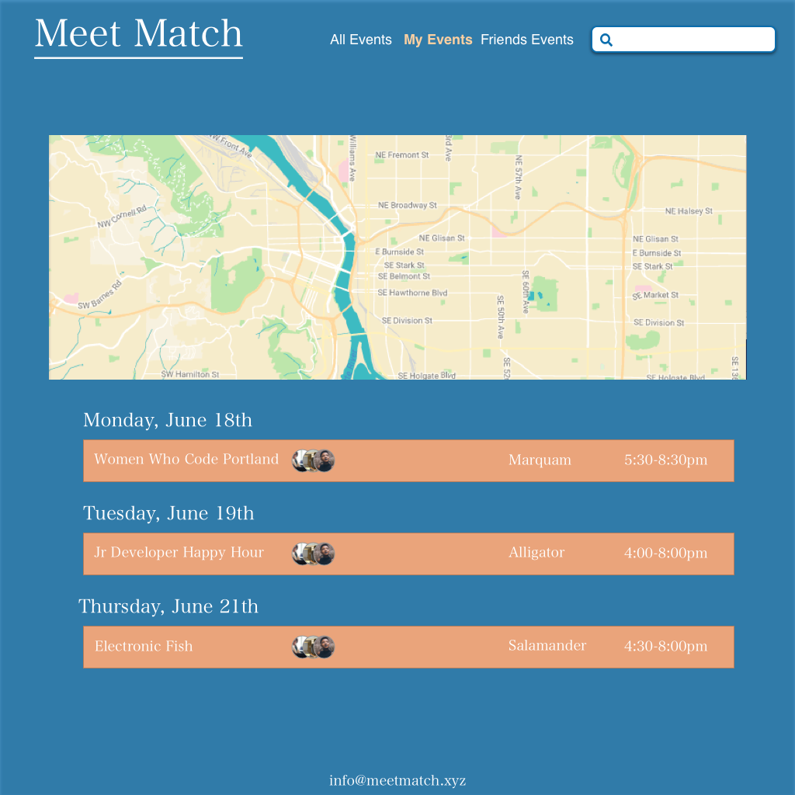

<!-- Twitter icon from https://github.com/carlsednaoui/gitsocial -->
[1.1]: http://i.imgur.com/tXSoThF.png (twitter icon with padding)
## Team Week 3

#### _Meet Match_
UI Week 5: Team Week: Wireframes

### Dawn Mott :sunrise_over_mountains:
Collab with Sean McDermott on Design _June 15th, 2018_

### Description
Wireframes in Sketch for our UI Team Week Project.

### Plan
- Design Wireframes in Sketch
- Export
- Create in SCSS when folder is ready

### Wireframes
#### Home/Landing Page

#### My Events

#### Friends

#### Logo

#### Favicon

### Setup/Installation Requirements
* Read the readme
* More to come

### Known Bugs

_There are many known :bug: at this time, this is a work in progress_

### Support and contact details

_If you'd like to chat, please contact_ @dawnrparty _on_ ![alt text][1.1]

### Technologies Used
markdown

<!-- 

 -->

### License

*This page is licensed under the MIT license*

&copy; 2018 Dawn Mott :sunrise_over_mountains:
